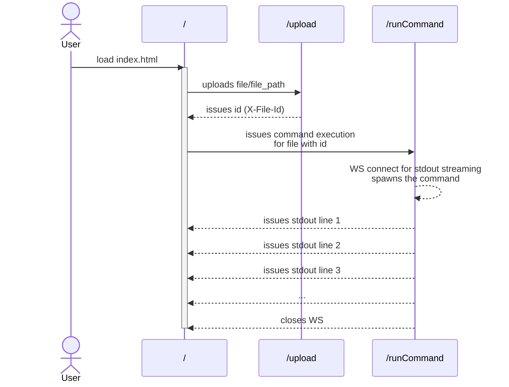

# Websocket file executor

[](../../actions/workflows/build.yml)

HTTP server that facilitate file upload and command execution on this uploaded file, with streaming stdout back to the page.

Endpoints provided:

- `/` - serves [index.html](static/index.html)
- `/upload` - uploads a file and `file_path` parameter. Persists uploaded file under path `${upload_dir}/${id}/${file_path}/${file_name}`, where `id` is a random uuid. Keeps track of the mentioned path under `id`. Returns the `id` as `X-File-Id` response header
- `/runCommand` - accepts parameters for command and `id`, runs a command on the file. Command is hardcoded on the web page to either: `cat`, `wc`, `sh` or `bogus-cmd`



## Assumptions

- upload and command execution are performed in 2 separate requests, as POST `/upload` cannot upgrade to WS connection - this is handled GET `/runCommand` endpoint which takes `id` provided by `/upload`. Orchestration of the 2 requests is responsibility of the initiating web page.
- WS connection is initiated from the client (web page)
- `file_path` is a multiform field that whilst added, is not necessary to the mechanism which ids every upload with unique uuid anyways

## Design

There are 2 layers to the design - web routing layer and `Service` layer. The routing is handled by [main.rs](src/main.rs), which wires in the `Service`, establishes routes and other configurations. Out of the 3 endpoints, `/` just serves static [index.html](/static/index.html), '/upload' pass through the `Service`, `/runCommand` passes through to `Service` together with a channel, where stdout is provided, which the endpoint subsequently forwards inside the WS. Heavy lifting is done inside [service.rs](src/service.rs)' `Service`, which handles file persistence, command execution, registration/deregistration of file ids, synchronization. `Service` is implemented as a trait, allowing for testing via [mockall](https://crates.io/crates/mockall). Implementation of the `Service` - `ProdService` is tested as is, with file interactions and test-only helper functions.

`actix_web` was chosen for the server framework, due to its WS support, performance (faster than `Rocket`), and from initial glance - reduced macro complexity.

Front end was influenced by <https://github.com/actix/examples/tree/master/websockets/echo-actorless>.

## Usage

Start server with:

```sh
cargo run
```

Open <http://localhost:8080>, select command (either `cat` | `wc` | `sh` | `bogus-cmd`), type in file_path, select file to upload, hit `Run`. File is uploaded, registered, WS connection is established, command execution initiated and stdout piped back to the web page via WS, until WS is closed when no more stdout output. Note: for `sh` testing, best to choose a shell script (eg. [roundtrip1.sh](test-stage/scripts/roundtrip1.sh)) with `sleep`s inside, as this exhibits the nature of the streamed output. `bogus-cmd` is used for testing failure scenarios.

## Testing

For unit testing:

```sh
cargo test
```

Unit testing comprises:

- route availability testing. Note: due to complexity of multiform data/WS upgrade, basic availability is tested
- `ProdService`'s upload and cmd execution
- white box parallel testing of upload/cmd execution, mimicking web page interaction. Note: this doesn't go through `actix_web` machinery.

For manual testing, see [Usage](#usage), and play with file imports/command running.

## Snags

- I'm using actix_rt for actix related runtime, tokio for command spawning, should settle on 1
- Need more tests for error conditions
